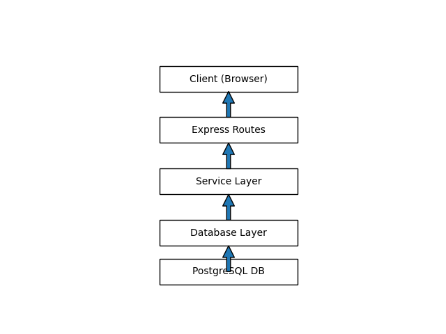

# 🌍 Travel Tracker App

## 🚀 Overview

A professional Node.js + Express application that allows users to track
countries they have visited.

------------------------------------------------------------------------

## 🏗 Architecture



### Layers Explained

1.  **Client (Browser)**
    -   Sends HTTP requests
    -   Displays rendered EJS views
2.  **Express Routes**
    -   Handles incoming requests
    -   Delegates logic to services
3.  **Service Layer**
    -   Contains business logic
    -   Validates inputs
    -   Coordinates database operations
4.  **Database Layer**
    -   Manages PostgreSQL connection
    -   Executes SQL queries safely
5.  **PostgreSQL Database**
    -   Stores users
    -   Stores countries
    -   Stores visited countries

------------------------------------------------------------------------

## 📂 Project Structure

    project/
    │
    ├── server.js
    ├── database/
    │   └── setup.sql
    ├── routes/
    ├── views/
    ├── public/
    └── .env

------------------------------------------------------------------------

## ⚙️ Technologies Used

-   Node.js
-   Express.js
-   PostgreSQL
-   EJS
-   body-parser

------------------------------------------------------------------------

## ✨ Features

-   Create multiple users
-   Add visited countries
-   Prevent duplicate country entries
-   Switch between users
-   Clean architecture with separation of concerns
-   Structured error handling

------------------------------------------------------------------------

## 🔐 Environment Variables (.env)

    DB_USER=app_user
    DB_HOST=localhost
    DB_NAME=postgres
    DB_PASSWORD=your_password
    DB_PORT=5432

------------------------------------------------------------------------

## 🛠 Installation

``` bash
npm install
node server.js
```

Open:

    http://localhost:3000

------------------------------------------------------------------------

## 🧠 Engineering Principles Applied

-   Separation of Concerns
-   Service Layer Pattern
-   DRY (Don't Repeat Yourself)
-   Defensive Error Handling
-   Clean Code Structure

------------------------------------------------------------------------

## 📈 Future Improvements

-   Add authentication & authorization
-   Add visit count tracking
-   Add caching layer
-   Convert to REST API
-   Deploy to cloud (Railway / Render / AWS)

------------------------------------------------------------------------

## 📜 License

MIT

------------------------------------------------------------------------

Built with a professional backend mindset.
